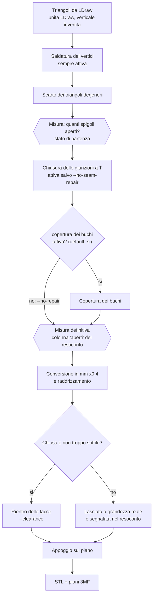

# Spigoli aperti, gioco e taratura

Tre cose che sembrano lo stesso problema e non lo sono. Questo documento spiega che cosa
significano gli "spigoli aperti" che segnala il resoconto, perché il gioco (*clearance*) è un
problema completamente diverso, e in che punto esatto i due si toccano.

---

## 1. Il malinteso di fondo: superficie non vuol dire solido

La geometria dei pezzi arriva dalla [LDraw Parts Library](https://library.ldraw.org). LDraw è
nata per **disegnare** mattoncini a schermo, non per **fabbricarli**. Per disegnare basta
sapere dove sta la superficie: se una faccia non si vede mai perché è dentro un altro pezzo, si
può semplicemente non disegnarla e nessuno se ne accorge.

Una stampante 3D fa una domanda diversa, e la fa per ogni singolo strato: **questo punto è
dentro il pezzo o fuori?** Per rispondere serve una superficie che divida lo spazio in due,
senza scampo. Una superficie con un buco non divide niente: da quel buco "dentro" e "fuori"
comunicano, e la domanda non ha risposta.

> Un modello per stampare deve essere un **solido chiuso** (in gergo: *watertight*, *manifold*).
> Un modello LDraw è una **collezione di superfici**. Il lavoro di Lego2STL è trasformare la
> seconda cosa nella prima, e dire onestamente quando non ci è riuscito.

---

## 2. Che cos'è uno "spigolo aperto"

Una mesh è fatta di **vertici** (punti), **triangoli** (tre vertici) e **spigoli** (i lati di un
triangolo, cioè una coppia di vertici).

La regola è una sola:

> In un solido chiuso, **ogni spigolo appartiene a esattamente due triangoli**.

Il motivo è geometrico, non convenzionale. Ogni pezzo di superficie ha un bordo; se cammini
lungo quel bordo e da un lato c'è superficie e dall'altro no, sei sul bordo di un buco.

| Triangoli che usano lo spigolo | Che cosa significa | Come lo chiama il resoconto |
|:---:|---|---|
| **1** | C'è un buco: manca il triangolo dall'altro lato | `aperti` (spigolo aperto) |
| **2** | Corretto: la superficie prosegue | — |
| **3+** | Superfici che si incontrano in un modo che nessun solido può avere | *non-manifold* |

Visto di taglio:

```
    superficie chiusa                 spigolo aperto
    (spigolo condiviso)               (un solo triangolo)

    *---------*                       *---------*
    |\        |                       |\        |
    | \   B   |                       | \   B   |
    |  \      |                       |  \      |
    |   \     |                       |   \     |
    | A  \    |                       | A  \    |        <- qui non c'e' nulla
    |     \   |                       |     \   |
    *------*--*                       *------*--*
                                              ^
    lo spigolo centrale e'                    questo spigolo appartiene
    percorso da A e da B                      solo ad A: e' un buco
```

Quando Bambu Studio apre un file e dice *"the model is not manifold / needs repair"*, sta
contando esattamente questa cosa.

### Il caso subdolo: la giunzione a T

Non tutti gli spigoli aperti sono buchi veri. Il caso più frequente è questo:

```
    A---------------B          Il triangolo di sinistra ha lo spigolo lungo A-B.
     \             /|          Il triangolo di destra ha due spigoli, A-M e M-B.
      \           / |
       \         /  |          Le due superfici si toccano lungo tutta la linea:
        \       M   |          non c'e' nessun buco fisico.
         \     / \  |
          \   /   \ |          Ma A-B e' usato da un solo triangolo, quindi conta
           \ /     \|          come spigolo aperto. Il vertice M "cade a meta'"
            *-------*          dello spigolo A-B senza farne parte.
```

Succede ogni volta che due superfici suddivise in modo diverso si incontrano — cioè
continuamente, perché un pezzo LDraw è assemblato da decine di file diversi (un pannello del
set di riferimento ne usa 37). **Non è un difetto del disegno: è un effetto del montaggio.**

---

## 3. Le tre cause, e le tre cure

Lego2STL affronta le tre cause in ordine, perché ognuna va risolta prima che si possa misurare
la successiva.

### 3.1 Vertici duplicati → saldatura (sempre attiva)

Il formato sorgente dichiara i vertici di ogni triangolo in modo indipendente. Due triangoli
che condividono uno spigolo scrivono quello spigolo **due volte**, con coordinate identiche
fino all'ultima cifra ma numericamente separate. Finché non vengono fusi, *nessuno spigolo
risulta condiviso* e la mesh sembra fatta di triangoli scollegati.

La saldatura fonde i vertici che stanno nello stesso punto. Tolleranza predefinita: `1e-3`
**unità LDraw**, cioè 0,4 micrometri — molto sotto qualsiasi dettaglio reale, quindi fonde solo
ciò che era destinato a essere lo stesso punto.

> ⚠️ La tolleranza si esprime in **unità LDraw** (1 unità = 0,4 mm), non in millimetri: la
> fusione avviene prima della conversione. `--weld-tolerance 0.01` vale 0,004 mm, non 0,01 mm.
> Lo dicono l'help del comando e l'etichetta nella finestra.

Questa fase non è disattivabile: senza di essa non si può nemmeno *misurare* se una superficie
è chiusa.

### 3.2 Giunzioni a T → chiusura delle giunzioni (attiva di default)

Lo spigolo lungo `A-B` viene **spezzato** nel vertice `M` che già ci sta sopra. Il triangolo
diventa due triangoli, e i due spigoli risultanti sono condivisi correttamente.

La riparazione è **esatta**: non inventa nessuna posizione nuova, non cambia la forma di un
micrometro. Usa un punto che era già lì.

Si disattiva con `--no-seam-repair`, ma non c'è quasi mai motivo di farlo. Misurata sui pezzi
reali, è **la maggior parte del problema e a volte tutto il problema**: tre pezzi di prova sono
passati da 36, 48 e 68 spigoli aperti a zero, e un pannello complesso da 334 a 138.

### 3.3 Buchi veri → copertura (attiva di default)

Quello che resta dopo le prime due fasi sono buchi autentici: pezzi di superficie che nel file
sorgente semplicemente **non ci sono**, perché non si vedevano.

La copertura cammina lungo gli spigoli liberi finché non tornano al punto di partenza — questo
traccia il contorno del buco — e stende un ventaglio di triangoli da un punto al centro del
contorno.

```
    contorno del buco                 dopo la copertura

    *-----*-----*                     *-----*-----*
    |            \                    | \   |   / |
    |             *                   |  \  |  /  *
    *              |                  *---\-C-/---|     C = nuovo punto al centro
     \             |                   \   \|/    |
      *-----*------*                    *---*-----*
```

**Questa è l'unica fase che inventa superficie.** È attiva di default lo stesso, perché un buco
in una forma che dovrebbe essere piena non è un'informazione che valga la pena conservare, e
*ogni slicer lo copre comunque*, in silenzio e senza dire quale. Farlo qui vuol dire che il
resoconto può dirlo.

`--no-repair` la spegne, e lascia le superfici esattamente come sono arrivate.

Sul set di riferimento, la copertura porta le forme complete **da 11 su 44 a 33 su 44**.

### Riepilogo

| Fase | Che cosa fa | Inventa geometria? | Opzione |
|---|---|:---:|---|
| Saldatura | Fonde i vertici coincidenti | no | `--weld-tolerance` (sempre attiva) |
| Giunzioni | Spezza lo spigolo su un vertice che ci sta già sopra | no | attiva; `--no-seam-repair` la spegne |
| Copertura | Stende triangoli sui buchi rimasti | **sì** | attiva; **`--no-repair`** la spegne |

---

## 4. Perché coprirli qui, se lo slicer lo fa comunque?

Perché **non è la stessa cosa**, e la differenza è tutta nel sapere che cosa è successo.

| | Lego2STL | Bambu Studio |
|---|---|---|
| Ripara i buchi | sì | sì |
| Dice **quali** pezzi avevano buchi | sì, nel resoconto | no |
| Dice **quanti** buchi per pezzo | sì, colonna `buchi` | no |
| Permette di applicare il gioco | **sì** | irrilevante |
| Riparazione ripetibile e identica | sì | dipende dalla versione |

Il punto non è che lo slicer non sappia riparare. Il punto è che lo fa in silenzio: se un pezzo
esce sbagliato non c'è modo di sapere se il buco c'era già o se è stata la riparazione a
inventare la superficie nel posto sbagliato. Il resoconto lo dice.

E soprattutto: **con `--no-repair` il gioco non può essere applicato** ai pezzi con buchi. È qui
che i due argomenti si incontrano.

---

## 5. Il gioco (*clearance*): un problema completamente diverso

Il gioco **non ha niente a che vedere** con gli spigoli aperti. Non è un difetto della mesh: è
la differenza fra una quota disegnata e una quota stampata.

### Il problema

Nel catalogo, un asse Technic misura esattamente 4,8 mm e il foro in cui entra misura
esattamente 4,8 mm. Sulla carta sono la stessa quota, e infatti è così che vengono disegnati.

Nella realtà i due pezzi stampati a iniezione differiscono di qualche centesimo, e **quella
differenza è tutto l'accoppiamento**. Stampati come disegnati non entra niente in niente —
anzi, peggio: la stampa 3D aggiunge materiale invece di toglierlo (larghezza di estrusione,
*elephant foot* sul primo strato, ritiro del materiale), quindi il pezzo esce abbondante su
ogni faccia.

### La cura: rientrare ogni faccia

`--clearance 0.15` sposta **ogni faccia** verso l'interno di 0,15 mm. Un asse da 4,8 mm diventa
4,5 mm; il foro da 4,8 mm diventa 5,1 mm. La coppia guadagna 0,6 mm di gioco complessivo.

```
      nominale                    con gioco di 0,15 mm

   +--------------+              +--------------+
   |              |              |  +--------+  |   <- ogni faccia rientra di 0,15
   |    4,8 mm    |              |  | 4,5 mm |  |
   |              |              |  +--------+  |
   +--------------+              +--------------+
```

### Perché non basta "spostare ogni vertice lungo la sua normale media"

È l'errore classico, ed è silenzioso. La media delle normali dei triangoli che si incontrano in
un vertice è **pesata da quanti triangoli capita che ce ne siano**. Lo spigolo di un cubo è
toccato da un triangolo di una faccia e da due delle altre, puramente per come i quadrati sono
stati tagliati in diagonale. Il risultato è che le facce rientrano di quantità diverse a
seconda della triangolazione: misurato su un cubo di 20 mm a cui si chiedevano 0,15 mm,
**l'errore era più della metà**.

La soluzione corretta è un sistema di equazioni. Ogni **faccia distinta** che passa per il
vertice impone una condizione: *"dopo lo spostamento devi essere 0,15 mm più vicino a me"*.

- Uno **spigolo di cubo** ha 3 facce → 3 equazioni, il punto è determinato esattamente.
- Un vertice **su uno spigolo** ha 2 facce → potrebbe scivolare lungo lo spigolo.
- Un vertice **in mezzo a una faccia piana** ha 1 faccia → potrebbe scivolare ovunque sul piano.
- Un vertice **su un cilindro** ne ha una ventina.

Si risolve cercando la **soluzione di norma minima**: il vertice si sposta di quanto le facce
richiedono e non un briciolo di più, così niente scivola di lato senza motivo. *"Faccia
distinta"* è la parola chiave: le due metà triangolari di un quadrato contano come una faccia
sola, altrimenti si torna esattamente all'errore della media.

### Le due condizioni in cui il gioco viene rifiutato

Il gioco non viene lasciato cadere in silenzio quando non si può applicare. Viene **rifiutato
per nome**, e il pezzo è scritto a grandezza reale:

| Motivo | Che cosa è successo | Come si risolve |
|---|---|---|
| `aperta` | La superficie ha ancora buchi. Rientrare le facce trascinerebbe anche i **bordi dei buchi**, deformando la forma invece di rimpicciolirla. | Togliere **`--no-repair`** |
| `sottile` | Una parete già più sottile del doppio del gioco verrebbe **rivoltata all'incontrario**. | Ridurre `--clearance`, o accettare quel pezzo a grandezza reale |

**Ecco il legame fra i due argomenti.** Il gioco ha bisogno di una forma che abbia un *dentro*
verso cui muovere le facce. Un buco non ha un dentro. Quindi:

> `--clearance` insieme a `--no-repair` funziona solo sui pezzi già chiusi, e lascia gli altri
> a grandezza reale. Il resoconto li elenca uno per uno.

---

## 6. L'ordine delle operazioni

L'ordine non è casuale: ogni fase ha bisogno del risultato della precedente.



Due dettagli che vale la pena notare:

- **La misura che finisce nel resoconto è presa dopo le riparazioni e prima di qualsiasi
  scalatura.** Descrive la forma, non le unità di misura.
- **La conversione in millimetri viene prima del gioco**, perché il gioco si esprime in
  millimetri e va applicato a una forma già misurata in millimetri. L'appoggio sul piano viene
  *dopo* il gioco, altrimenti il pezzo resterebbe sospeso di 0,15 mm.

Un solo passaggio produce sia gli STL sia i piani 3MF: la forma riparata è la stessa in
entrambi. Non esiste un caso in cui l'STL è chiuso e il 3MF no.

---

## 7. La taratura (*calibration*)

### Perché non esiste un valore predefinito

Il gioco giusto dipende da: stampante, ugello, materiale, temperatura, velocità, e da come la
macchina si sta comportando oggi. E soprattutto:

> **Il valore cercato è più piccolo della differenza fra due macchine dello stesso modello.**

Per questo Lego2STL non propone un valore: propone un modo di **misurare il proprio**.

### Come funziona

```
lego2stl calibration
```

Scrive lo stesso pezzo più volte, a giochi diversi:

- **Pezzi predefiniti**: `3705` (un asse) e `4265c` (la boccola che ci scorre sopra). Una
  coppia, non un pezzo singolo, perché **un accoppiamento è una proprietà di due pezzi**. E
  sono entrambi già chiusi, quindi il gioco si può applicare senza dover coprire niente.
- **Valori predefiniti**: 0,00 · 0,05 · 0,10 · 0,15 · 0,20 · 0,25 mm.
- Nella cartella finisce anche `how-to-use-these.txt`, perché quando i pezzi escono dalla
  stampante il comando che li ha generati è ormai lontano.

Durante la taratura la copertura dei buchi è **forzata a prescindere**: un pezzo di taratura
che uscisse a grandezza reale in silenzio manderebbe all'aria tutto l'esercizio.

### Come si legge il risultato

1. Stampare **tutta la serie** con il materiale, la macchina e le impostazioni che si intendono
   usare davvero.
2. Provare le coppie **partendo dal valore più piccolo** e salendo.
3. Fermarsi al primo che **si unisce senza forzare e resta unito se lo si scuote**.
4. Quel valore è il proprio. Passarlo come `--clearance`.

Va rifatta quando si cambia materiale, ugello o stampante. Non quando si cambia modello.

Per cambiare pezzi o valori:

```
lego2stl calibration --part 3673 --part 3713 --steps 0.08,0.10,0.12,0.14
```

---

## 8. Ricette pratiche

```bash
# Il caso normale: forme chiuse, niente riparazione nello slicer
lego2stl extract istruzioni.pdf 2-5 --lang it

# Trovare il proprio gioco (una volta per stampante/materiale)
lego2stl calibration --lang it

# La produzione vera, dopo la taratura
lego2stl extract istruzioni.pdf 2-5 --clearance 0.15 --lang it

# Diagnosi: com'e' messa la geometria di partenza, senza coperture
lego2stl extract istruzioni.pdf 2-5 --no-repair --lang it
# poi leggere report.txt, colonna "aperti"
```

Nella finestra sono le stesse caselle, nella scheda **Opzioni**; la riga in fondo mostra il
comando equivalente.

---

## 9. Come si legge il resoconto

```
pezzo         tri  aperti  giunz  buchi  dimensioni (mm)
3705         1284       0     48      0  32.0 x 4.8 x 4.8   Technic Axle 4
32316         982     138    334      2  63.9 x 7.9 x 7.9   Technic Beam 8
```

| Colonna | Significato |
|---|---|
| `tri` | Triangoli nella forma finale |
| `aperti` | Spigoli aperti **rimasti alla fine**. `0` = solido chiuso, pronto per la stampa |
| `giunz` | Spigoli saldati dalla chiusura delle giunzioni (riparazione esatta) |
| `buchi` | Buchi coperti dalla copertura (superficie inventata; `0` ovunque con `--no-repair`) |

Sotto la tabella, le righe di riepilogo: quante forme sono chiuse, quante ha completato la sola
chiusura delle giunzioni, quanti buchi sono stati coperti. E, se è stato chiesto un gioco,
quante forme lo hanno ricevuto — con l'elenco per nome di quelle che non lo hanno ricevuto e
perché.

Una forma conta come *completata dalle giunzioni* solo se dopo non è stato necessario coprire
nessun buco: la copertura agisce su ciò che resta aperto dopo le giunzioni, quindi una forma
con buchi coperti non era, per definizione, finita dalle sole giunzioni.

---

## 10. Limiti dichiarati

Onestà su che cosa **non** fa:

- **Contorni che si diramano.** Se il bordo di un buco non si chiude ad anello ma si biforca —
  succede quando due buchi si toccano in un punto — la copertura non indovina: conta il caso e
  lascia stare. Lo slicer li ripara comunque in fase di stampa.
- **Il ventaglio dal centro è una superficie inventata.** Su un contorno che non sta su un
  piano, il ventaglio può sporgere leggermente. È la scelta giusta per la bocca di un foro (il
  caso comune), meno per contorni molto irregolari.
- **Nessun controllo di autointersezione.** Superfici che si compenetrano non vengono rilevate.
  Sui pezzi reali le superfici sono pulite a parte i buchi: gli spigoli usati da tre o più
  triangoli sono risultati costantemente zero.
- **Il gioco non tocca la geometria fine.** Rientra le facce di una quantità uniforme; non
  smussa, non compensa l'*elephant foot* strato per strato, non corregge i fori in modo diverso
  dai perni.
- **Pareti sottili restano sottili.** Perni, assi e boccole Technic hanno pareti pari o
  inferiori alla larghezza di un ugello da 0,4 mm. Le travi vengono bene; i pezzetti di
  collegamento sono al limite. La schermata Catalogo li segnala.

---

## Glossario

| Italiano | Inglese | Che cos'è |
|---|---|---|
| Spigolo aperto | *open edge*, *naked edge* | Spigolo usato da un solo triangolo: un buco |
| Chiuso / stagno | *watertight*, *manifold* | Ogni spigolo usato da esattamente due triangoli |
| Giunzione a T | *T-junction* | Un vertice che cade a metà dello spigolo di un altro triangolo |
| Saldatura dei vertici | *vertex welding* | Fusione di vertici coincidenti in uno solo |
| Copertura dei buchi | *hole filling* | Stendere triangoli su un contorno aperto |
| Gioco | *clearance*, *tolerance* | Quanto rientrare ogni faccia perché i pezzi si incastrino |
| Taratura | *calibration* | Misurare il gioco che serve alla propria stampante |
| Normale | *normal* | La direzione perpendicolare a una faccia, che punta verso l'esterno |
| Unità LDraw (LDU) | *LDraw unit* | L'unità del catalogo: 1 LDU = 0,4 mm, un mattoncino standard è 20 LDU |
